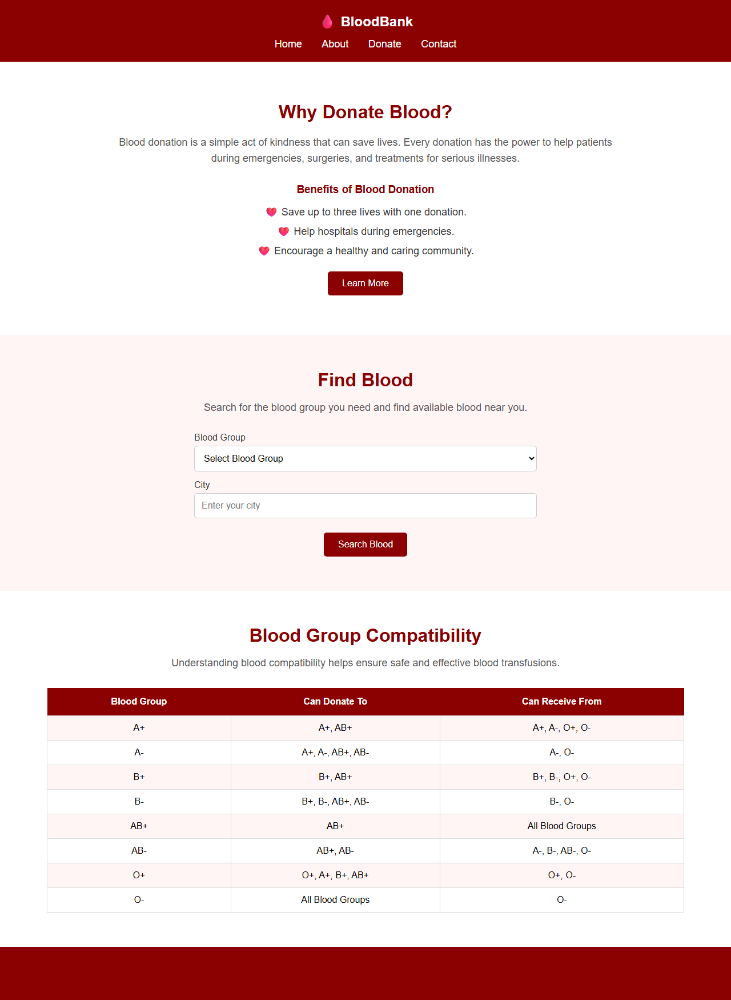

# Deployment

Evidence for the deployment milestones, kept in the repository so it can be checked rather than
taken on trust.

## The live site

**https://skit-devops-2026.github.io/devops-24ESKCS042/**

Verified serving at the time of writing:

| Check | Result |
|-------|--------|
| HTTP status | `200` |
| Page title | `BloodBank` |
| Blood bank content present | yes |
| Not a 404 page | confirmed |



The screenshot above is a real capture of that URL, taken with headless Chrome at 1280x1750. It
is the page as served by GitHub Pages, not a local copy of the files.

## How it is deployed

GitHub Pages, published from the `main` branch at the repository root. There is no build step and
no server: the project is a static site, so the HTML and CSS that GitHub already stores in the
repository are exactly what the browser receives. Pages is configured to build from `main//`
(branch `main`, path `/`) and the current source status is `built`.

Deployment is therefore continuous by construction. A merge to `main` is the deployment, and
there is no separate publish step that could be forgotten or could drift from the code.

## The container image

The Docker image is published to GitHub Container Registry on every push to `main`:

```
ghcr.io/skit-devops-2026/bloodbank:<commit-sha>
ghcr.io/skit-devops-2026/bloodbank:latest
```

Both tags are pushed by the `container` job in [`../.github/workflows/ci.yml`](../.github/workflows/ci.yml),
which builds the image, runs the test suite **inside** the built image, logs in to GHCR with
`GITHUB_TOKEN`, tags, pushes, and then pulls the tag back and prints the digest the registry
reports.

That last step matters more than it looks. A zero exit code from `docker push` is not proof that a
usable image exists — a tag can be created while the manifest underneath it is wrong. Pulling it
back closes the loop, so a green step in the run history is genuine evidence that the image is in
the registry and is pullable.

The job is ordered `needs: [hygiene, build-and-test]`, so a failed hygiene check or a failed
source test stops the pipeline before anything is published. The registry only ever contains
images that passed every check.

### Note on package visibility

The package is created private by default, the same as any container package published with
`GITHUB_TOKEN`. The round-trip verification runs as the workflow's own token, so it is unaffected.
If you need to pull the image as an external user, or from a Kubernetes cluster with no
credentials, set the package to public in
`Settings -> Packages -> bloodbank -> Change visibility`.

## Kubernetes

Manifests are in [`../k8s/`](../k8s/): a `Deployment` and a `Service`, with consistent selectors
and a `targetPort` referenced by name so the two cannot silently drift apart. The Deployment
references the `latest` tag with `imagePullPolicy: Always`, so a cluster picks up the newest
successful build without a manifest edit on every push. The file header documents the trade-off
and the reproducible alternative: pin the commit-SHA tag and switch to `IfNotPresent`.

## CI/CD pipeline

The whole chain is automated in one workflow, triggered on pull requests and on pushes to `main`:

| Job | On PR | On push to main |
|-----|-------|-----------------|
| `Repository hygiene` | runs | runs |
| `Build and test` | runs | runs |
| `Container build, test and publish` | builds and tests in-container; push and round trip skipped, because `GITHUB_TOKEN` is read-only on fork PRs | builds, tests, pushes, and verifies the pull-back |

The push and verification steps are deliberately gated on `github.event_name == 'push'`. On a pull
request the build and the in-container test still run, so a PR is still fully verified — there is
simply no attempt to publish from a context that has no permission to publish.

## Delivery history

Every change was delivered through a branch and a pull request, and merged only after CI was
green.

| PR | Change | Merged |
|----|--------|--------|
| [#5](https://github.com/skit-devops-2026/devops-24ESKCS042/pull/5) | Repair README merge damage, repository housekeeping rules | 2026-09-29 |
| [#6](https://github.com/skit-devops-2026/devops-24ESKCS042/pull/6) | Kubernetes Deployment and Service manifests | 2026-09-29 |
| [#7](https://github.com/skit-devops-2026/devops-24ESKCS042/pull/7) | Build, test in-container and publish to GHCR | 2026-09-29 |
| [#8](https://github.com/skit-devops-2026/devops-24ESKCS042/pull/8) | Verify the published image pulls back from GHCR | 2026-09-29 |

## Reproducing this yourself

```bash
# the live site
curl -sI https://skit-devops-2026.github.io/devops-24ESKCS042/ | head -1

# the test suite, locally
make test

# the image, locally
docker build -t bloodbank .
docker run --rm bloodbank sh /opt/bloodbank/tests/test_project.sh /usr/share/nginx/html
docker run --rm -p 8080:80 bloodbank     # then visit http://localhost:8080
```

See [`TESTING.md`](TESTING.md) for what the suite covers and how to extend it.
